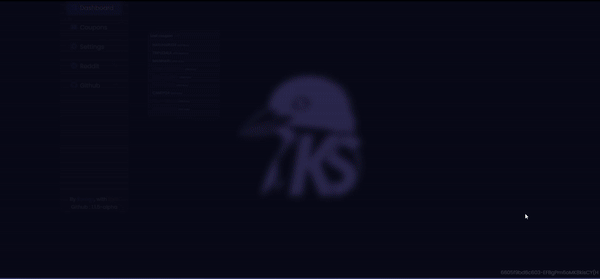
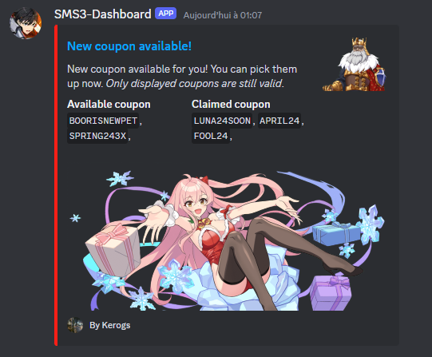

<p align="center">
  
</p>
<p align="center">
    <h1 align="center">SWORD-MASTER-STORY-DASHBOARD</h1>
</p>
<p align="center">
    <em>(self hosted website) Real-time Coupon Management for Sword Master Story Players </em>
</p>
<p align="center">
	
	
	
	
<p>
<p align="center">
		<em>Developed with the software and tools below.</em>
</p>
<p align="center">


</p>

<hr>

<center><h3>Dashboard Preview</h3></center>
<div align="center"> 

</div>

## 🔗 Quick Links

> - [📍 Overview](#-overview)
> - [📦 Features](#-features)
> - [🚀 Getting Started](#-getting-started)
>   - [⚙️ Installation](#️-installation)
> - [🛠 Project Roadmap](#-project-roadmap)
> - [🤝 Contributing](#-contributing)
> - [📄 License](#-license)

## 📍 Overview

This project aims to provide a convenient dashboard for players of the game Sword Master Story. It offers real-time updates on available coupons, allows users to track their usage, and facilitates the sharing of new coupons via Discord webhooks.

## 📦 Features
- Real-time coupon updates
- Tracking of used coupons
- Differentiation between available, used, and expired coupons
- Manual action to send new coupons to Discord via webhooks

<center><h3>Discord Webhooks Preview</h3></center>
<div align="center">
 
</div>

## 🚀 Getting Started

1. Clone the Sword-Master-Story-Dashboard repository:

```sh
git clone https://github.com/kerogs/Sword-Master-Story-Dashboard
```

2. You can now host the site on a server or on your own machine with a tool such as xamp, wam, mamp, ...

## 🛠 Project Roadmap
- [x] responsive
- [x] Real-time change of LastClaim and LastAvailable, TotalClaim and TotalAvailable values when retrieving codes
- [x] Retrieve coupons automatically and display them for reclamation
- [x] Show the difference between available, recovered and expired coupons
- [x] Allow list to be sent to discord from webhooks (action to be activated manually)
- [ ] Synchronize lists between different account (to have the same thing on different devices)
- [ ] Enable the site to send information automatically on request (need to be enable) (like a logs send to discord channel)
- [ ] Copy automatically when a code is clicked
- [ ] Add an automatic site update from the settings page

## 🤝 Contributing

Contributions are welcome! Here are several ways you can contribute:

- **[Submit Pull Requests](https://github.com/kerogs/Sword-Master-Story-Dashboard/blob/main/CONTRIBUTING.md)**: Review open PRs, and submit your own PRs.
- **[Join the Discussions](https://github.com/kerogs/Sword-Master-Story-Dashboard/discussions)**: Share your insights, provide feedback, or ask questions.
- **[Report Issues](https://github.com/kerogs/Sword-Master-Story-Dashboard/issues)**: Submit bugs found or log feat


## 📄 License
This project is licensed under the Mozilla 2.0 License.

## 